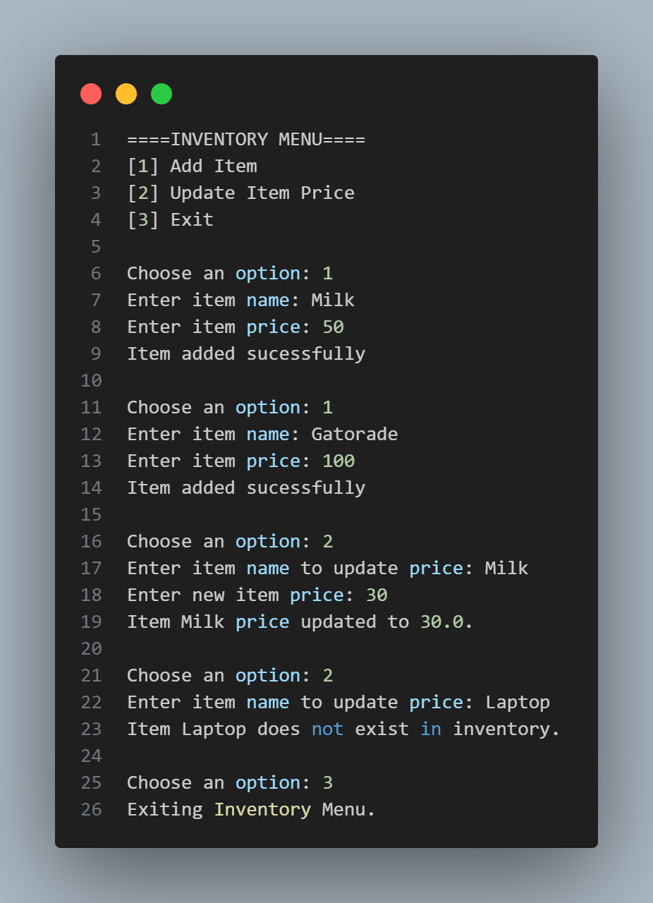

# Assignment for Programming Languages CS15L(4404)

## Activity Title
**Activity 1 - Python Inventory System**

## Problem Description
This activity requires creating a simple inventory system using lists and dictionaries in Python.

## Sample output
.png)

## Author
``Yosh B. Batula``

## Screenshot of running program

